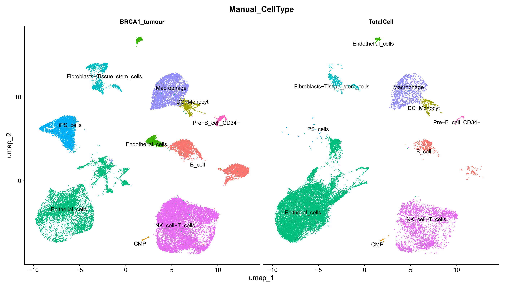
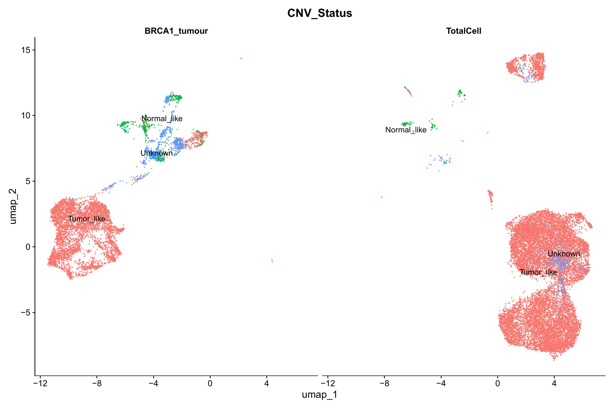
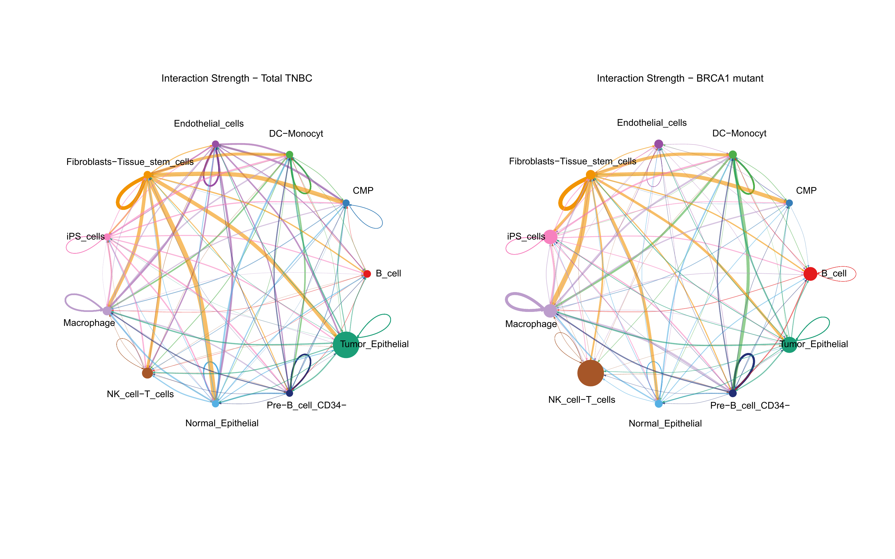
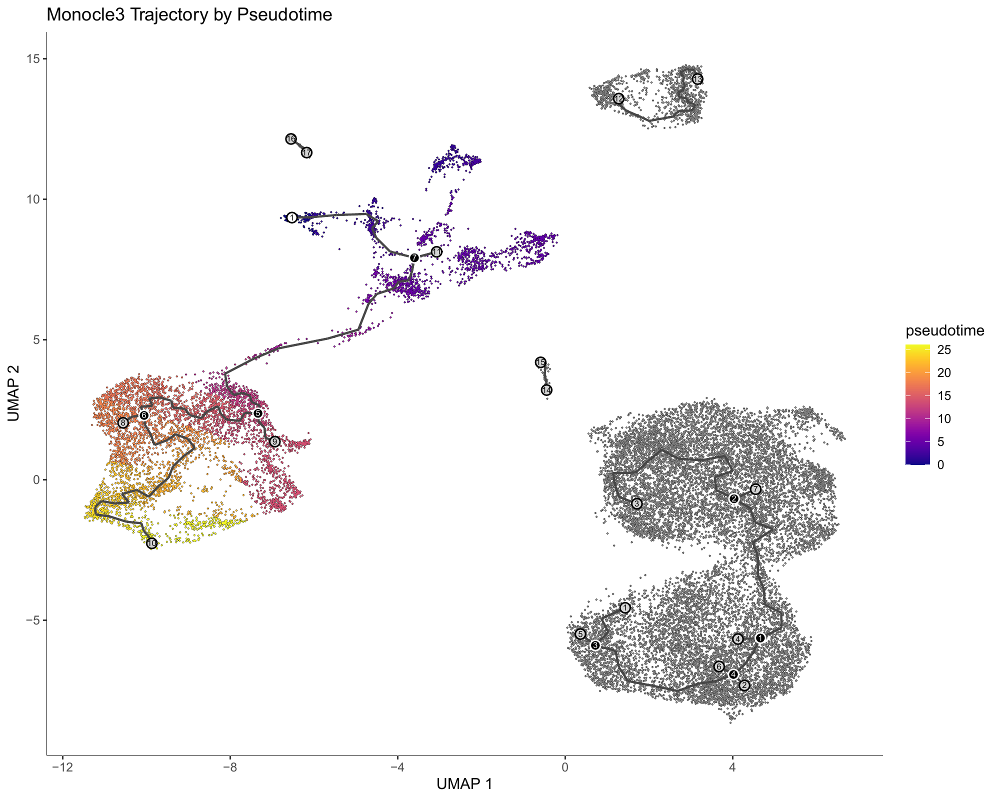
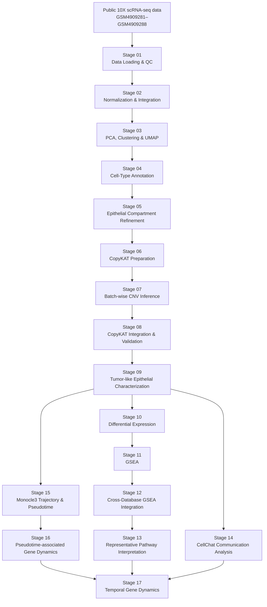

# TNBC BRCA1 Single-Cell Analysis

[](https://doi.org/10.5281/zenodo.22723081)\
\
\

## Overview

This repository contains a reproducible, stage-organized single-cell RNA-sequencing (scRNA-seq) workflow for characterizing cellular composition, epithelial heterogeneity, inferred copy-number states, differential transcriptional programs, pathway enrichment, cell–cell communication, trajectory structure, pseudotime-associated genes, and temporal gene-expression programs in triple-negative breast cancer (TNBC).

The principal biological comparison is between **BRCA1_tumour** and **TotalCell** groups, with the main downstream molecular analyses performed within the **tumor-like epithelial compartment** defined using computationally inferred CNV state.

The workflow is organized as a sequence of explicit analytical stages rather than as a collection of isolated analyses. Each stage has a defined computational purpose and, where appropriate, dedicated scripts, result directories, validation tables, execution logs, and documentation.

The complete workflow progresses from public single-cell expression data through:

1. Data loading and quality control
2. Normalization and integration
3. PCA, clustering, and UMAP
4. Cell-type annotation
5. Epithelial compartment refinement
6. CopyKAT input preparation
7. Batch-wise CNV inference
8. CopyKAT integration and validation
9. Tumor-like epithelial characterization
10. Differential expression
11. Gene set enrichment analysis
12. Cross-database GSEA integration
13. Representative pathway interpretation
14. Cell–cell communication analysis
15. Monocle3 trajectory and pseudotime analysis
16. Pseudotime-associated gene dynamics
17. Temporal gene clustering and integrated biological interpretation

The repository is intended as a computational research resource for reproducible analysis and hypothesis generation rather than as a substitute for experimental validation.

---

## Representative Results

The figures below provide a visual overview of the analysis, from cell-type organization and inferred CNV state to predicted cell–cell communication and trajectory structure. Click a figure to open the corresponding high-resolution PDF.

<table>
<tr>
<td align="center"><a href="results/04_CellType_Annotation/figures/main/UMAP_Manual_CellTypes_Split.pdf"></a><br><strong>Cell-type landscape</strong></td>
<td align="center"><a href="results/08_CopyKAT_Integration/figures/main/CopyKAT_CNV_Status_UMAP.pdf"></a><br><strong>Inferred CNV state</strong></td>
</tr>
<tr>
<td align="center"><a href="results/14_CellChat/figures/main/CellChat_Overall_Network_Weight.pdf"></a><br><strong>Predicted cell–cell communication</strong></td>
<td align="center"><a href="results/15_Monocle3_Trajectory/figures/main/Trajectory_Pseudotime_Final.pdf"></a><br><strong>Trajectory and pseudotime structure</strong></td>
</tr>
</table>

---

# Scientific Motivation

TNBC is characterized by substantial cellular and molecular heterogeneity. Single-cell analysis provides an opportunity to examine this heterogeneity at multiple levels, including:

* cellular composition,
* epithelial and non-epithelial compartments,
* inferred tumor-associated CNV states,
* transcriptional differences between biological groups,
* coordinated pathway-level programs,
* predicted intercellular communication,
* pseudotemporal organization,
* and coherent gene-expression programs associated with different regions of an inferred trajectory.

The central analytical strategy is therefore hierarchical:

**cell identity → epithelial refinement → inferred tumor state → transcriptional comparison → pathway interpretation → cellular communication → trajectory → gene dynamics → temporal programs**

This design is intended to reduce the risk of interpreting signals driven primarily by differences in cellular composition as tumor-cell-specific molecular programs.

---

# Study Design

## Biological Groups

The principal comparison is:

* **BRCA1_tumour**
* **TotalCell**

The main differential-expression and pathway analyses are performed within cells classified as **tumor-like epithelial** according to the inferred CopyKAT CNV state.

This compartment-specific strategy is important because comparisons across the complete single-cell dataset can be strongly influenced by differences in cellular composition.

---

## Input Samples

The analysis uses eight single-cell samples:

* GSM4909281
* GSM4909282
* GSM4909283
* GSM4909284
* GSM4909285
* GSM4909286
* GSM4909287
* GSM4909288

Raw expression data are processed at the beginning of the workflow and represented through staged Seurat-based analysis objects.

---

# Analytical Workflow



The workflow is modular and uses established outputs from upstream stages as inputs to downstream analyses. Where appropriate, downstream stages operate on frozen upstream objects to preserve analytical provenance and avoid unnecessary re-analysis.

---

# Stage-by-Stage Analysis

## Stage 01 — Data Loading and Quality Control

**Directory**

`results/01_Data_Loading_QC/`

### Purpose

Load the single-cell expression matrices, establish sample and biological-group metadata, merge the samples, and remove low-quality cells.

### Quality-control criteria

Cells are retained using:

* `nFeature_RNA > 200`
* `nFeature_RNA < 5000`
* `nCount_RNA < 40000`
* `percent.mt < 20`

### Main outputs

* `QC_violin_BRCA1_tumour.pdf`
* `QC_violin_TotalCell.pdf`
* `Step1_QC.log`

### Main object

`objects/TNBC_QC_filtered.rds`

This stage establishes the quality-controlled starting dataset for the downstream workflow.

---

## Stage 02 — Normalization and Integration

**Directory**

`results/02_Normalization_Integration/`

### Purpose

Normalize the biological groups and integrate them into a common expression representation while retaining the biological-group information required for downstream comparison.

### Main processing

* Log-normalization using `NormalizeData`
* Scale factor: `10,000`
* Highly variable feature selection using the `vst` method
* 2,000 variable features
* Integration feature selection
* Integration anchor identification
* Data integration

### Main outputs

* `Step2_Integration.log`

### Main objects

* `objects/TNBC_Integration_Anchors.rds`
* `objects/TNBC_Integrated.rds`

No primary figures are generated at this stage because its main purpose is construction of the integrated expression representation.

---

## Stage 03 — PCA, Clustering and UMAP

**Directory**

`results/03_PCA_Clustering_UMAP/`

### Purpose

Characterize the initial transcriptional structure of the integrated dataset and establish the unsupervised cellular organization used for annotation.

### Main processing

* Cell-cycle scoring using the updated 2019 cell-cycle gene sets
* Diagnostic PCA
* Cell-cycle difference calculation:
  `S.Score - G2M.Score`
* Regression of the cell-cycle difference
* PCA using 50 components
* Neighbor graph construction using dimensions 1–30
* Clustering at resolution 0.5
* UMAP using dimensions 1–30

### Main outputs

* `CellCycle_Diagnostic_PCA.pdf`
* `PCA_ElbowPlot.pdf`
* `UMAP_by_Biological_Group.pdf`
* `UMAP_by_Biological_Group_Split.pdf`
* `UMAP_by_CellCycle_Phase.pdf`
* `Step3_PCA_Clustering_UMAP.log`

### Main object

`objects/TNBC_PCA_Clustering_UMAP.rds`

---

## Stage 04 — Cell-Type Annotation

**Directory**

`results/04_CellType_Annotation/`

### Purpose

Assign biologically interpretable cell identities using complementary reference-based and manually curated annotation.

### Annotation strategy

The stage combines:

1. cluster-level marker analysis,
2. reference-based SingleR annotation,
3. manual annotation using project-specific cluster annotations.

SingleR uses the **Human Primary Cell Atlas** reference.

### Main outputs

* `UMAP_Manual_CellTypes_Split.pdf`
* `SingleR_CellType_Annotations.csv`
* `SingleR_CellType_Abundance.csv`
* `TNBC_cluster_markers_all.csv`
* `TNBC_cluster_markers_logFC2.csv`
* `Step4_CellType_Annotation.log`

### Main object

`objects/TNBC_Annotated.rds`

The resulting annotation provides the basis for epithelial compartment refinement and construction of the normal-cell reference population used in CopyKAT analysis.

---

## Stage 05 — Epithelial Compartment Refinement

**Directory**

`results/05_Epithelial_Compartment/`

### Purpose

Isolate and refine the epithelial compartment before tumor-state and downstream molecular analyses.

### Strategy

The epithelial population is isolated from the annotated dataset and reanalyzed using an epithelial-focused workflow.

The stage includes:

* epithelial subset extraction,
* re-normalization,
* variable-feature selection,
* PCA,
* epithelial-specific clustering,
* UMAP,
* marker analysis,
* balanced reference construction,
* manual epithelial subtype annotation,
* label transfer to the full epithelial population.

A balanced reference is constructed with a maximum of 1,000 cells per sample to reduce sample-size-driven representation effects during reference construction.

A subtype labeled **"Basal epithelial with immune signal"** is excluded from the purified epithelial population before the CopyKAT-focused analysis.

### Main outputs

* `Epithelial_Balanced_Annotated.pdf`
* `Epithelial_Transferred_Annotations.pdf`
* `Epithelial_Balanced_UMAP_Clusters.pdf`
* `Epithelial_DotPlot_AnnotationMarkers.pdf`
* `Epithelial_ElbowPlot.pdf`
* `Epithelial_UMAP_Clusters.pdf`
* `Epithelial_Subtype_Abundance.csv`
* epithelial marker tables

### Main objects

* `objects/TNBC_Epithelial_Subset.rds`
* `objects/TNBC_Epithelial_Balanced.rds`
* `objects/TNBC_Epithelial_Balanced_Annotated.rds`
* `objects/TNBC_Epithelial_Annotated.rds`
* `objects/TNBC_Epithelial_Pure.rds`

---

# CopyKAT-based Tumor-State Analysis

## Stage 06 — CopyKAT Preparation

**Directory**

`results/06_CopyKAT_Preparation/`

### Purpose

Construct a reproducible input population for large-scale copy-number inference.

The input combines:

* purified epithelial cells,
* selected non-epithelial populations used as normal-cell references.

### Normal reference populations

* NK_cell-T_cells
* B_cell
* Macrophage
* DC-Monocyte
* Fibroblasts-Tissue_stem_cells
* Endothelial_cells

### Main outputs

* `CopyKAT_Input_Summary.csv`
* `CopyKAT_Normal_Cell_Barcodes.csv`
* `Step6_CopyKAT_Preparation.log`

### Main object

`objects/copykat_inputs.rds`

The stage also verifies biological-group assignments and constructs the count matrix used for batch-wise CopyKAT inference.

---

## Stage 07 — Batch-wise CopyKAT CNV Inference

**Directory**

`results/07_CopyKAT_Batch_Inference/`

### Purpose

Perform CopyKAT inference in manageable batches while maintaining consistent parameters and recording batch-level provenance.

### Main parameters

* Batch size: 2,500 cells
* Minimum genes per cell: 200
* Minimum cells per gene: 3
* Minimum normal cells per batch: 20
* Genome: `hg20`
* ID type: `S`
* Distance: Pearson
* Number of cores: 4
* Random seed: 1234
* `ngene.chr = 5`
* `win.size = 25`
* `KS.cut = 0.1`

### Main outputs

* `run_copykat_batches.log`
* `tables/validation/batch_info.csv`

Batch-specific computational internals are retained locally but excluded from version control where appropriate.

---

## Stage 08 — CopyKAT Integration and CNV Validation

**Directory**

`results/08_CopyKAT_Integration/`

### Purpose

Integrate batch-wise CopyKAT predictions with the epithelial dataset and standardize inferred CNV states for downstream analysis.

### CNV state mapping

CopyKAT predictions are standardized as:

* **aneuploid → Tumor_like**
* **diploid → Normal_like**
* other or unresolved predictions → **Unknown**

Predictions are merged with epithelial metadata using cell barcodes.

### Main analyses

* CNV status by biological group
* CNV status on UMAP
* CNV status by sample
* CNV status by epithelial subtype
* prediction completeness
* missing-cell and extra-cell checks

### Main outputs

* `Barplot_CNV_by_Group.pdf`
* `CopyKAT_CNV_Status_UMAP.pdf`
* `UMAP_Epithelial_CNV_Status.pdf`
* `CopyKAT_CNV_by_Sample.csv`
* `CopyKAT_CNV_Proportions_by_Sample.csv`
* `copykat_combined_predictions.csv`
* CNV-by-subtype tables
* validation tables
* session information

### Main object

`objects/TNBC_Epithelial_CopyKAT.rds`

This stage establishes the computational definition of the **tumor-like epithelial compartment** used for the principal downstream molecular comparison.

---

## Stage 09 — Tumor-like Epithelial Characterization

**Directory**

`results/09_TumorLike_Epithelial_Characterization/`

### Purpose

Characterize the epithelial population classified as tumor-like according to inferred CNV state.

Only cells satisfying:

`CNV_Status == "Tumor_like"`

are carried into the principal tumor-like epithelial analyses.

### Main analyses

* tumor-like epithelial abundance by biological group
* inferred CNV distribution
* epithelial subtype composition
* tumor-like epithelial subtype composition by group
* UMAP visualization of tumor-like epithelial subtypes

### Main outputs

* `UMAP_TumorLike_Epithelial_Subtypes.pdf`
* `Barplot_TumorLike_Epithelial_Subtypes_by_Group.pdf`
* `CNV_by_Group.csv`
* `CNV_by_Group_Percent.csv`
* `TumorLike_EpithelialSubtype_by_Group.csv`
* `TumorLike_EpithelialSubtype_Percent_by_Group.csv`

### Main object

`objects/TNBC_Epithelial_TumorLike.rds`

This stage defines the population used for the principal BRCA1_tumour versus TotalCell molecular comparison.

---

# Molecular Comparison and Pathway Analysis

## Stage 10 — Differential Expression

**Directory**

`results/10_Differential_Expression/`

### Purpose

Identify transcriptional differences between **BRCA1_tumour** and **TotalCell** within tumor-like epithelial cells.

### Statistical framework

Differential expression uses Seurat `FindMarkers` with:

* Wilcoxon rank-sum test
* `min.pct = 0.10`
* `logfc.threshold = 0.25`
* positive and negative genes retained

The analysis reports:

* adjusted p-values,
* average log2 fold-change,
* detection percentages,
* direction of change,
* detection-frequency differences.

### Direction convention

Positive `avg_log2FC`:

**Higher in BRCA1_tumour**

Negative `avg_log2FC`:

**Higher in TotalCell**

### Statistical significance

Genes with:

`adjusted p-value < 0.05`

are considered statistically significant.

For volcano-plot classification, an additional effect-size threshold of:

`|avg_log2FC| >= 0.5`

is applied.

### Main outputs

* `Volcano_BRCA1_vs_TotalCell_TumorLike.pdf`
* `Heatmap_Top_DEGs_TumorLike.pdf`
* complete DEG table
* significant DEG table
* upregulated DEG table
* downregulated DEG table
* top-20 upregulated genes
* top-20 downregulated genes
* summary statistics

The complete ranked DEG result provides the input signal for the subsequent GSEA analysis.

---

## Stage 11 — Gene Set Enrichment Analysis

**Directory**

`results/11_GSEA/`

### Purpose

Move from individual differentially expressed genes to coordinated pathway-level biological programs.

The complete Stage 10 DEG table is ranked by:

`avg_log2FC`

without applying an additional significance or fold-change filter before ranking for GSEA.

### Gene identifier processing

The workflow:

1. resolves duplicate gene symbols,
2. maps gene symbols to Entrez identifiers,
3. resolves duplicate Entrez mappings,
4. constructs the ranked gene list.

### Gene-set resources

Four complementary resources are analyzed:

* Gene Ontology Biological Process
* Reactome
* KEGG
* MSigDB Hallmark

### GSEA parameters

* `minGSSize = 10`
* `maxGSSize = 500`
* `pvalueCutoff = 1`
* Benjamini–Hochberg adjustment

### Direction convention

* **NES > 0** → enrichment toward BRCA1_tumour
* **NES < 0** → enrichment toward TotalCell
* adjusted p-value < 0.05 → statistically significant enrichment

### Main figures

* `GSEA_GO_BP_dotplot.pdf`
* `GSEA_Hallmark_dotplot.pdf`
* `GSEA_KEGG_dotplot.pdf`
* `GSEA_Reactome_dotplot.pdf`

Complete enrichment tables, direction-specific results, significant pathways, ranked genes, and validation summaries are retained.

---

## Stage 12 — Cross-Database GSEA Integration

**Directory**

`results/12_GSEA_Integration/`

### Purpose

Integrate pathway-level evidence across GO Biological Process, Hallmark, KEGG, and Reactome rather than interpreting individual pathway databases independently.

### Main objectives

* identify recurring biological terms,
* compare enrichment across databases,
* identify pathways supported by multiple resources,
* summarize direction-specific enrichment,
* prioritize representative biological programs.

### Main outputs

* `GSEA_Integrated_top10_dotplot.pdf`
* `GSEA_Integrated_significant.csv`
* `GSEA_Integrated_BRCA1_tumour.csv`
* `GSEA_Integrated_TotalCell.csv`
* `GSEA_Integrated_database_summary.csv`
* `GSEA_Integrated_recurring_terms.csv`
* `GSEA_Integrated_top10_per_database_direction.csv`
* database validation tables
* integration summary

Cross-database integration is used to reduce dependence on any single pathway resource.

---

## Stage 13 — Representative GSEA Pathway Interpretation

**Directory**

`results/13_GSEA_Biological_Interpretation/`

### Purpose

Translate integrated enrichment results into a concise set of representative biological programs.

The interpretation prioritizes pathways that are:

* statistically supported,
* biologically interpretable,
* recurrent across analyses,
* and sufficiently distinct to limit excessive redundancy.

### Main outputs

* `Step13_Representative_GSEA_Pathways.pdf`
* `Step13_Representative_GSEA_Pathways.csv`
* direction-specific supplementary tables
* database distribution summary
* QC summary
* redundancy-group summary
* `Step13_Representative_GSEA.log`

This stage is an interpretation layer built on the integrated enrichment results rather than an independent re-analysis of the expression matrix.

---

# Tumor Ecosystem and Trajectory Analysis

## Stage 14 — Cell–Cell Communication Analysis

**Directory**

`results/14_CellChat/`

### Purpose

Characterize predicted intercellular communication patterns and compare communication networks between **BRCA1_tumour** and **TotalCell**.

CellChat is used to examine:

* overall communication network structure,
* interaction number,
* interaction strength,
* pathway-level communication,
* and communication involving the tumor-like epithelial compartment.

### Main analyses

* overall network count
* overall network weight
* pathway ranking comparison
* tumor epithelial incoming interactions
* tumor epithelial outgoing interactions
* differential interaction counts
* differential interaction weights
* cell-type centrality
* communication pathway comparisons

### Main figures

* `CellChat_Overall_Network_Count.pdf`
* `CellChat_Overall_Network_Weight.pdf`
* `CellChat_RankNet_Pathway_Comparison.pdf`
* `CellChat_Tumor_Epithelial_Incoming_Top20.pdf`
* `CellChat_Tumor_Epithelial_Outgoing_Top20.pdf`

Additional supplementary figures provide centrality and differential communication analyses.

### Main tables

The stage retains:

* cell-type proportions,
* communication matrices,
* pathway comparisons,
* summary statistics,
* tumor-epithelial incoming and outgoing interactions,
* top interaction tables,
* QC and validation tables.

CellChat computational objects are generated during the analysis but large serialized objects are excluded from the public repository where appropriate.

### Interpretation

CellChat results represent **predicted communication based on ligand–receptor expression patterns**. They should not be interpreted as experimentally demonstrated physical interactions.

---

## Stage 15 — Monocle3 Trajectory and Pseudotime

**Directory**

`results/15_Monocle3_Trajectory/`

### Purpose

Investigate transcriptional organization of the tumor-like epithelial population along an inferred trajectory.

Monocle3 is used to construct a trajectory representation and derive pseudotime values.

### Main outputs

* `Trajectory_Pseudotime_Final.pdf`
* `Trajectory_CNV_Status_Final.pdf`
* `Monocle3_Pseudotime_Metadata.csv`
* `Pseudotime_Summary_by_CNV_Status.csv`
* trajectory partition statistics
* root-node candidates
* selected trajectory root
* partition candidates

### Validation framework

The stage includes checks covering:

* pseudotime finiteness,
* pseudotime distributions,
* CNV-state distribution across pseudotime,
* partition structure,
* graph projection,
* trajectory root selection,
* Seurat/Monocle3 transfer,
* normal-like versus tumor-like pseudotime comparison.

### Interpretation

Monocle3 pseudotime represents an **inferred transcriptional ordering**. It does not by itself establish a physical lineage, developmental history, or experimentally observed cell-state transition.

---

## Stage 16 — Pseudotime-associated Gene Dynamics

**Directory**

`results/16_Pseudotime_Gene_Dynamics/`

### Purpose

Identify genes whose expression varies systematically along the inferred pseudotime trajectory and characterize the biological programs associated with those genes.

This stage extends trajectory analysis from cell ordering to **gene-level temporal association**.

### Major analytical components

* trajectory-associated gene identification,
* graph-based testing,
* Moran's I analysis,
* statistical significance assessment,
* effect-size characterization,
* selection of strong trajectory-associated genes,
* KEGG pathway enrichment,
* pathway ranking and prioritization.

### Moran's I analysis

Moran's I is used to identify genes with graph-dependent expression structure along the trajectory.

The repository retains:

* complete Moran's I rankings,
* significant genes,
* strong trajectory-associated genes,
* effect-size summaries,
* p-value summaries,
* q-value summaries,
* top gene sets.

### Pathway analysis

Trajectory-associated genes are mapped to KEGG pathways to identify biological processes associated with the inferred temporal organization.

### Main figures

* `04_Morans_I_vs_Q_value.pdf`
* `05_Top30_Morans_I_Genes.pdf`

Additional supporting figures summarize Moran's I, p-values, q-values, and related distributions.

Stage 16 provides the gene-level foundation for the temporal clustering analysis in Stage 17.

---

# Stage 17 — Temporal Gene Dynamics

**Directory**

`results/17_Temporal_Gene_Dynamics/`

### Purpose

Identify and interpret distinct temporal gene-expression programs along the inferred pseudotime trajectory.

This is the **final analytical stage of the current pipeline**.

The analysis progresses through:

**temporal association → temporal clustering → cluster characterization → pathway enrichment → cross-database biological interpretation → final integration and validation**

---

## Stage 17A — Temporal Association and Initial Characterization

The stage begins by characterizing significant and strong temporal genes and their association with pseudotime.

Representative outputs include:

* significant temporal genes,
* strong temporal genes,
* top temporal genes,
* temporal association summaries,
* pseudotime distributions,
* representative temporal associations,
* Spearman correlation distributions.

---

## Stage 17B — Temporal Gene Clustering

Genes with coherent temporal behavior are grouped into temporal expression programs.

The analysis retains:

* temporal cluster assignments,
* cluster rankings,
* cluster centroids,
* cluster summaries,
* top genes per cluster,
* z-score expression profiles,
* silhouette evaluation,
* structural validation.

### Cluster validation

Silhouette-based analyses are retained to assess the internal coherence and separation of the identified temporal clusters.

---

## Stage 17C — Temporal Cluster Characterization

This stage characterizes the temporal behavior of individual genes and temporal clusters.

Outputs include:

* cluster centroids,
* temporal summaries,
* gene-level temporal characterization,
* gene/cluster correlation rankings,
* temporal features,
* pseudotime-bin summaries,
* individual gene temporal profiles.

The purpose is to distinguish coherent temporal programs from isolated or noisy individual gene trajectories.

---

## Stage 17D — GO Biological Process Interpretation

Each principal temporal cluster is characterized using Gene Ontology Biological Process enrichment.

Main figures include:

* `Stage17D_GO_BP_Dotplot_Cluster_1.pdf`
* `Stage17D_GO_BP_Dotplot_Cluster_2.pdf`
* `Stage17D_Temporal_Cluster_Gene_Counts.pdf`
* `Stage17D_Temporal_Cluster_Profiles.pdf`

Complete enrichment results and interpretation summaries are retained.

---

## Stage 17E — Reactome and Hallmark Validation

Temporal clusters are further evaluated using complementary pathway resources:

* MSigDB Hallmark
* Reactome

This provides an additional cross-database assessment of the biological programs identified from temporal gene clusters.

### Main figures

* `Stage17E_Hallmark_Dotplot_Cluster_1.pdf`
* `Stage17E_Hallmark_Dotplot_Cluster_2.pdf`
* `Stage17E_Reactome_Dotplot_Cluster_1.pdf`
* `Stage17E_Reactome_Dotplot_Cluster_2.pdf`

The repository also retains supporting database-level mapping, enrichment, and validation information.

---

## Stage 17F — Final Integrated Biological Interpretation and Validation

Stage 17F is the final integration stage of the pipeline.

It integrates evidence from:

* temporal gene clusters,
* temporal gene rankings,
* GO Biological Process,
* KEGG,
* Reactome,
* Hallmark,
* cluster comparisons,
* and cross-database biological themes.

### Main figures

* `Stage17F_Cross_Database_Biological_Themes.pdf`
* `Stage17F_Temporal_Cluster_Gene_Counts.pdf`

### Main tables and summaries

* `Stage17F_Temporal_Dynamics_Summary.csv`
* `Stage17F_Temporal_Gene_List.csv`
* `Stage17F_Final_Integrated_Temporal_Pathway_Table.csv`
* `Stage17F_Final_Cluster_Comparison.csv`
* `Stage17F_Integrated_Cluster_Interpretation.csv`
* `Stage17F_Final_Summary.csv`
* `Stage17F_Representative_Pathways_By_Theme.csv`
* `Stage17F_Final_Biological_Summary.txt`

Additional supplementary and validation outputs are stored in the corresponding Stage 17 subdirectories.

### Final computational object

The final integrated Stage 17 object is:

`objects/Stage17F_Temporal_Gene_Dynamics_Final.rds`

---

# Final Temporal Interpretation

The final temporal analysis identifies two principal temporal gene programs.

## Temporal Cluster 1

An **early-peaking temporal program** characterized by genes associated with:

* antigen processing and presentation,
* MHC class II-associated immune functions,
* and mitochondrial respiratory activity.

## Temporal Cluster 2

A **broad late-emerging temporal program** characterized by:

* increased translational activity,
* mitochondrial energy metabolism,
* and an epithelial-associated component supported by the temporal gene composition.

These findings describe **transcriptional programs associated with different regions of an inferred trajectory**.

They should not be interpreted as evidence that one mature cell type physically converts into another, nor as proof of a causal lineage relationship.

---

# Key Analytical Principles

## 1. Compartment-specific analysis

The principal molecular comparison is performed within the **tumor-like epithelial compartment**.

This helps distinguish transcriptional differences within the selected population from differences caused primarily by overall cellular composition.

---

## 2. Computational tumor-state inference

CopyKAT is used to infer large-scale copy-number states from single-cell expression data.

The resulting `Tumor_like` classification is therefore a **computationally inferred state** and should not be interpreted as a direct experimental measurement of malignancy.

---

## 3. Multi-database pathway interpretation

Pathway-level conclusions are not based on a single enrichment resource.

The workflow integrates:

* GO Biological Process,
* Hallmark,
* KEGG,
* Reactome.

Recurring signals across complementary resources are used to support biological interpretation.

---

## 4. Explicit validation

Where appropriate, analytical stages retain validation outputs alongside primary results.

Examples include:

* sample-level summaries,
* prediction completeness,
* missing/extra cell checks,
* identifier mapping QC,
* communication-network validation,
* trajectory validation,
* temporal-cluster validation,
* enrichment consistency,
* and final-stage validation.

---

## 5. Separation of analysis and interpretation

The workflow distinguishes between:

* primary statistical analysis,
* integrated summaries,
* representative visualization,
* and biological interpretation.

This separation improves traceability from a biological statement back to its computational source.

---

## 6. Conservative biological interpretation

Computational results are interpreted as evidence of **associated transcriptional or pathway-level programs** rather than as proof of mechanism.

In particular:

* CopyKAT does not replace direct genomic validation.
* CellChat does not establish physical ligand–receptor interactions.
* Monocle3 pseudotime does not establish lineage or developmental direction.
* Temporal clustering does not establish causal temporal mechanisms.

---

# Repository Structure

```text
TNBC_BRCA1_SingleCell/
│
├── README.md
│
├── scripts/
│   ├── 01_Data_Loading_QC.R
│   ├── 02_Normalization_DataIntegration.R
│   ├── 03_PCA_Clustering_UMAP.R
│   ├── 04_CellType_Annotation.R
│   ├── 05_Epithelial_Compartment_Refinement.R
│   ├── 06_CopyKAT_Preparation.R
│   ├── 07_CopyKAT_CopyNumber_Inference.R
│   ├── 08_CopyKAT_Integration.R
│   ├── 09_TumorLike_Epithelial_Characterization.R
│   ├── 10_Differential_Expression.R
│   ├── 11_GSEA.R
│   ├── 12_GSEA_Integration.R
│   ├── 13_Representative_GSEA_Pathways.R
│   ├── 14_CellChat.R
│   ├── 15_Monocle3_Trajectory_Analysis.R
│   ├── 16A_Frozen_Stage15_Validation.R
│   ├── 16B_Pseudotime-associated_Gene_Discovery.R
│   ├── 16C_Graph-associated_Gene_Characterization.R
│   ├── 16D_KEGG_Enrichment.R
│   ├── 16E_KEGG_Interpretation.R
│   ├── 17_Pseudotime_Gene_Dynamics.R
│   ├── 17B_Temporal_Gene_Clustering.R
│   ├── 17C_Temporal_Characterization.R
│   ├── 17D_Biological_Interpretation.R
│   ├── 17E_Reactome_Hallmark_Validation.R
│   ├── 17F_Final_Integration_and_Validation.R
│   └── README.md
│
├── metadata/
│   ├── cluster_annotations.csv
│   └── epithelial_cluster_annotations.csv
│
├── objects/
│   └── Selected analysis objects
│
├── results/
│   ├── 01_Data_Loading_QC/
│   ├── 02_Normalization_Integration/
│   ├── 03_PCA_Clustering_UMAP/
│   ├── 04_CellType_Annotation/
│   ├── 05_Epithelial_Compartment/
│   ├── 06_CopyKAT_Preparation/
│   ├── 07_CopyKAT_Batch_Inference/
│   ├── 08_CopyKAT_Integration/
│   ├── 09_TumorLike_Epithelial_Characterization/
│   ├── 10_Differential_Expression/
│   ├── 11_GSEA/
│   ├── 12_GSEA_Integration/
│   ├── 13_GSEA_Biological_Interpretation/
│   ├── 14_CellChat/
│   ├── 15_Monocle3_Trajectory/
│   ├── 16_Pseudotime_Gene_Dynamics/
│   └── 17_Temporal_Gene_Dynamics/
│
├── docs/
│   ├── DATA_AVAILABILITY.md
│   ├── METHODS.md
│   ├── REPRODUCIBILITY.md
│   ├── FINAL_REPOSITORY_SUMMARY.csv
│   └── FINAL_REPOSITORY_SUMMARY.txt
│
├── environment/
├── logs/
└── notebooks/
```

Large intermediate objects and internal analysis/audit files may be excluded from version control according to the repository `.gitignore` configuration.

---

# Results Organization

Analytical result directories generally follow a common organizational scheme:

```text
Stage/
├── figures/
│   ├── main/
│   └── supplementary/
│
├── tables/
│   ├── main/
│   ├── supplementary/
│   └── validation/
│
└── logs/
```

Not every stage contains every directory.

### Main

Primary figures and tables used to communicate the principal analytical findings.

### Supplementary

Supporting analyses, detailed gene/pathway tables, secondary visualizations, and extended results.

### Validation

Quality-control, integrity, provenance, mapping, and analytical validation outputs.

### Logs

Execution logs and, where available, software/session information.

---

# Stage 17 Output Organization

The final temporal-analysis outputs follow the current repository architecture:

```text
results/
└── 17_Temporal_Gene_Dynamics/
    ├── figures/
    │   ├── main/
    │   └── supplementary/
    │
    ├── tables/
    │   ├── main/
    │   ├── supplementary/
    │   └── validation/
    │
    └── logs/

objects/
└── Stage17F_Temporal_Gene_Dynamics_Final.rds
```

This structure separates publication-oriented figures, detailed analytical tables, validation records, execution logs, and the final integrated computational object.

---

# Key Data Flow

The principal analysis-object flow is:

```text
Raw 10X expression data
        │
        ▼
TNBC_QC_filtered.rds
        │
        ▼
TNBC_Integration_Anchors.rds
        │
        ▼
TNBC_Integrated.rds
        │
        ▼
TNBC_PCA_Clustering_UMAP.rds
        │
        ▼
TNBC_Annotated.rds
        │
        ▼
TNBC_Epithelial_Subset.rds
        │
        ├── TNBC_Epithelial_Balanced.rds
        │       │
        │       ▼
        │   TNBC_Epithelial_Balanced_Annotated.rds
        │
        ▼
TNBC_Epithelial_Annotated.rds
        │
        ▼
TNBC_Epithelial_Pure.rds
        │
        ▼
CopyKAT input
        │
        ▼
Batch-wise CNV inference
        │
        ▼
TNBC_Epithelial_CopyKAT.rds
        │
        ▼
TNBC_Epithelial_TumorLike.rds
        │
        ├───────────────┬────────────────┬─────────────────┐
        ▼               ▼                ▼                 ▼
       DEGs            GSEA           CellChat          Monocle3
        │               │                │                 │
        ▼               ▼                ▼                 ▼
   Molecular       Pathway-level    Predicted         Pseudotime
   comparison      interpretation   communication          │
                                                          ▼
                                                Pseudotime-associated
                                                        genes
                                                          │
                                                          ▼
                                                   Temporal clustering
                                                          │
                                                          ▼
                                             Cross-database biological
                                                    interpretation
```

---

# Reproducibility

## Software Environment

The core analysis was developed using:

* **R 4.5.2**
* **Bioconductor 3.22**
* **Seurat 5.5.0**

The workflow additionally uses established R/Bioconductor and single-cell analysis packages for:

* cell-type annotation,
* CNV inference,
* differential expression,
* pathway enrichment,
* cell–cell communication,
* trajectory inference,
* and temporal gene analysis.

Exact package and session information is retained in stage-specific logs where available.

---

# Reproducibility and Provenance Principles

The repository follows several principles intended to preserve analytical traceability.

### Stage-specific outputs

Each analytical stage writes its outputs to a dedicated result directory.

### Separation of analysis objects and presentation outputs

Large computational objects are kept separate from publication-oriented figures and tables.

### Validation is retained

Validation files are preserved alongside analytical results rather than discarded after successful execution.

### Explicit output ownership

Each result belongs to the stage that directly generates it.

### Frozen upstream analyses

Where appropriate, downstream stages use established upstream outputs rather than unnecessarily rerunning the complete pipeline.

### Refactoring is separated from biological re-analysis

Repository organization, documentation, and script cleanup are treated separately from changes to the underlying analytical methodology.

---

# Interpretation Framework

The results should be interpreted within the limitations of scRNA-seq and computational inference.

## This workflow can support identification of

* transcriptional heterogeneity,
* cellular composition,
* epithelial substructure,
* inferred CNV-associated tumor-like states,
* differential transcriptional programs,
* pathway-level enrichment,
* predicted cell–cell communication,
* inferred pseudotemporal organization,
* and coherent temporal gene-expression programs.

## This workflow does not independently establish

* experimental lineage relationships,
* physical cell-state conversion,
* causal mechanisms,
* direct ligand–receptor interactions,
* experimentally validated CNV states,
* or clinical efficacy.

The computational results therefore provide evidence for **associations and coordinated molecular programs**, not direct experimental proof of mechanism.

---

# Important Biological Interpretation Note

The final temporal programs should be described as:

**coordinated transcriptional programs associated with different regions of an inferred trajectory.**

They should not be interpreted as evidence that:

* immune cells physically become epithelial cells,
* epithelial cells undergo a confirmed lineage conversion,
* pseudotime represents experimentally observed developmental time,
* or temporal association alone establishes a causal mechanism.

The observed patterns are more appropriately interpreted as differences in transcriptional programs associated with different positions along the inferred tumor-cell trajectory.

---

# Main Figures

The repository contains publication-oriented PDF figures across the analytical stages.

## Cellular organization

* `UMAP_by_Biological_Group.pdf`
* `UMAP_by_Biological_Group_Split.pdf`
* `UMAP_Manual_CellTypes_Split.pdf`

## Epithelial compartment

* `Epithelial_Balanced_Annotated.pdf`
* `Epithelial_Transferred_Annotations.pdf`
* `Epithelial_Balanced_UMAP_Clusters.pdf`

## CNV and tumor-like state

* `Barplot_CNV_by_Group.pdf`
* `CopyKAT_CNV_Status_UMAP.pdf`
* `UMAP_Epithelial_CNV_Status.pdf`
* `UMAP_TumorLike_Epithelial_Subtypes.pdf`

## Differential expression

* `Volcano_BRCA1_vs_TotalCell_TumorLike.pdf`
* `Heatmap_Top_DEGs_TumorLike.pdf`

## Pathway analysis

* `GSEA_GO_BP_dotplot.pdf`
* `GSEA_Hallmark_dotplot.pdf`
* `GSEA_KEGG_dotplot.pdf`
* `GSEA_Reactome_dotplot.pdf`
* `GSEA_Integrated_top10_dotplot.pdf`
* `Step13_Representative_GSEA_Pathways.pdf`

## Cell–cell communication

* `CellChat_Overall_Network_Count.pdf`
* `CellChat_Overall_Network_Weight.pdf`
* `CellChat_RankNet_Pathway_Comparison.pdf`
* `CellChat_Tumor_Epithelial_Incoming_Top20.pdf`
* `CellChat_Tumor_Epithelial_Outgoing_Top20.pdf`

## Trajectory

* `Trajectory_Pseudotime_Final.pdf`
* `Trajectory_CNV_Status_Final.pdf`

## Pseudotime-associated gene dynamics

* `04_Morans_I_vs_Q_value.pdf`
* `05_Top30_Morans_I_Genes.pdf`

## Temporal gene dynamics

* `01_Pseudotime_Distribution.pdf`
* `02_Top30_Temporal_Gene_Associations.pdf`
* `Stage17B_Temporal_Cluster_Profiles.pdf`
* `Stage17B_Temporal_Gene_Clusters_Heatmap.pdf`
* `Stage17C_Cluster_Centroid_Heatmap.pdf`
* `Stage17C_Temporal_Cluster_Centroid_Profiles.pdf`
* `Stage17D_GO_BP_Dotplot_Cluster_1.pdf`
* `Stage17D_GO_BP_Dotplot_Cluster_2.pdf`
* `Stage17E_Hallmark_Dotplot_Cluster_1.pdf`
* `Stage17E_Hallmark_Dotplot_Cluster_2.pdf`
* `Stage17E_Reactome_Dotplot_Cluster_1.pdf`
* `Stage17E_Reactome_Dotplot_Cluster_2.pdf`
* `Stage17F_Cross_Database_Biological_Themes.pdf`
* `Stage17F_Temporal_Cluster_Gene_Counts.pdf`

---

# How to Navigate the Repository

For a rapid overview of the biological workflow:

```text
README.md
   │
   ▼
Stages 01–05
   │
   ▼
Cell identity and epithelial refinement
   │
   ▼
Stages 06–09
   │
   ▼
CopyKAT inference and tumor-like epithelial definition
   │
   ▼
Stages 10–13
   │
   ▼
Differential expression and pathway-level comparison
   │
   ├───────────────┐
   ▼               ▼
Stage 14         Stages 15–17
   │               │
   ▼               ▼
Cell–cell       Trajectory
communication      │
                   ▼
             Pseudotime-associated genes
                   │
                   ▼
             Temporal gene programs
```

For detailed methodological information, consult the stage-specific documentation together with the corresponding analysis script and execution log.

---

# Recommended Reading Order

For a first-time reviewer:

### 1. Start with the project overview

* `README.md`

### 2. Understand the cellular landscape

* Stage 01
* Stage 03
* Stage 04
* Stage 05

### 3. Understand the tumor-like epithelial definition

* Stage 06
* Stage 07
* Stage 08
* Stage 09

### 4. Examine the principal molecular comparison

* Stage 10
* Stage 11
* Stage 12
* Stage 13

### 5. Examine tumor-ecosystem communication

* Stage 14

### 6. Examine trajectory and temporal biology

* Stage 15
* Stage 16
* Stage 17

This order follows the principal analytical dependency structure of the project.

---

# Data Availability

The repository does not redistribute the original raw sequencing data.

Users should obtain the corresponding public single-cell data associated with samples:

* GSM4909281
* GSM4909282
* GSM4909283
* GSM4909284
* GSM4909285
* GSM4909286
* GSM4909287
* GSM4909288

The repository provides the computational workflow, metadata, scripts, reproducible result tables, figures, validation outputs, and methodological documentation required to understand and reproduce the analysis.

Additional information is provided in:

`docs/DATA_AVAILABILITY.md`

---

# Large and Intermediate Files

Large computational objects are not necessarily included in version control.

This includes serialized R objects and intermediate files that are expensive to store or are not required for repository-level reproducibility.

The repository therefore prioritizes:

* analysis scripts,
* metadata,
* reproducible result tables,
* publication-oriented figures,
* validation outputs,
* logs,
* and methodological documentation.

The `.gitignore` configuration documents the classes of local or generated files excluded from the public repository.

---

# Previous Pipeline Archive

An earlier version of the analysis workflow was archived separately:

**Zenodo DOI:** `10.5281/zenodo.17127154`

The present repository represents the structured TNBC/BRCA1 single-cell workflow developed from that earlier analysis framework, with expanded downstream characterization and explicit stage-level validation.

The archived version should be considered a historical analysis reference rather than a replacement for the current repository structure.

---

# Scientific Scope

This repository is intended as a computational research resource for investigating:

* TNBC tumor heterogeneity,
* epithelial tumor-state characterization,
* BRCA1-associated transcriptional programs,
* inferred CNV-associated tumor states,
* pathway-level molecular differences,
* tumor-ecosystem communication,
* pseudotemporal organization,
* and temporal gene-expression programs.

The workflow is designed primarily for **hypothesis generation, computational characterization, and reproducible analysis**.

Experimental validation remains necessary for establishing biological mechanisms and causal relationships.

---

# Repository Status

The repository represents a **structured and documented analysis workflow** in which the major computational stages, result outputs, validation records, and provenance information have been organized into a reproducible stage-based architecture.

The analytical workflow is currently treated as a **frozen analysis pipeline for repository preparation and scientific presentation**.

Repository organization, documentation, and code refactoring should not be interpreted as additional biological re-analysis unless explicitly stated in the corresponding stage documentation.

The current pipeline concludes with:

**Stage 17F — Final Integrated Biological Interpretation and Validation**

---

# Citation

If this repository or analyses derived from it are used in academic work, please cite the associated publication or manuscript when available.

A repository-specific citation can be added once the final manuscript and/or repository DOI has been established.

---

# Author

**Somayeh Sarirchi, PhD**

Computational Cancer Biology
Cancer Bioinformatics & Single-Cell Genomics

---

# License

License information will be added once the repository licensing decision has been finalized.

---

# Summary

This repository implements an end-to-end single-cell analysis framework that progressively moves from broad cellular characterization toward compartment-specific molecular and temporal interpretation:

```text
Public scRNA-seq data
        ↓
Quality Control
        ↓
Normalization / Integration
        ↓
Clustering / UMAP
        ↓
Cell-Type Annotation
        ↓
Epithelial Refinement
        ↓
CopyKAT CNV Inference
        ↓
Tumor-like Epithelial Definition
        ↓
Differential Expression
        ↓
Multi-database GSEA
        ↓
Pathway Integration / Interpretation
        ↓
Cell–Cell Communication
        ↓
Monocle3 Trajectory
        ↓
Pseudotime-associated Gene Dynamics
        ↓
Temporal Gene Clustering
        ↓
Cross-database Biological Interpretation
        ↓
Final Integrated Validation
```

The final analytical objective is to move beyond lists of differentially expressed genes and characterize **coherent molecular and temporal programs within the tumor-like epithelial compartment**, while maintaining explicit computational provenance, validation records, and conservative biological interpretation.
