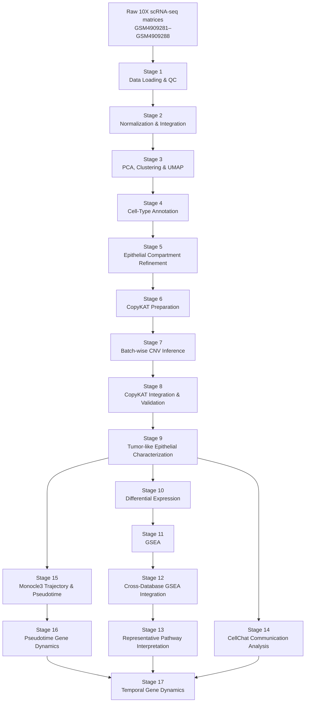

# TNBC BRCA1 Single-Cell Analysis

## Overview

This repository contains a reproducible, stage-organized single-cell RNA-sequencing (scRNA-seq) workflow for characterizing the cellular ecosystem, epithelial heterogeneity, inferred copy-number states, differential transcriptional programs, pathway activity, cell–cell communication, pseudotemporal organization, and temporal gene dynamics in triple-negative breast cancer (TNBC).

The analysis focuses on a comparison between **BRCA1_tumour** and **TotalCell** biological groups, with particular emphasis on the **tumor-like epithelial compartment**.

The workflow was designed as a transparent computational analysis rather than a collection of isolated plots. Each analytical stage has its own scripts, outputs, logs, validation tables, and stage-specific README where appropriate.

The complete pipeline proceeds from raw 10X expression matrices through:

1. Data loading and quality control
2. Normalization and integration
3. PCA, clustering, and UMAP
4. Cell-type annotation
5. Epithelial compartment refinement
6. CopyKAT input preparation
7. Batch-wise CNV inference
8. CopyKAT integration and validation
9. Tumor-like epithelial characterization
10. Differential expression
11. Gene set enrichment analysis
12. Cross-database GSEA integration
13. Biological interpretation of representative pathways
14. Cell–cell communication analysis with CellChat
15. Trajectory and pseudotime analysis with Monocle3
16. Pseudotime-associated gene dynamics and pathway analysis
17. Temporal gene clustering and cross-database biological interpretation

---

## Scientific Motivation

Triple-negative breast cancer is characterized by substantial cellular and molecular heterogeneity. A single-cell framework can help separate several layers of this heterogeneity:

* cellular composition,
* epithelial and non-epithelial compartments,
* tumor-like versus normal-like inferred CNV states,
* transcriptional differences between biological groups,
* coordinated pathway-level programs,
* intercellular communication,
* pseudotemporal organization of tumor-like epithelial cells,
* and genes whose expression varies systematically along the inferred trajectory.

The central analytical strategy is therefore to move progressively from **cell identity → epithelial refinement → inferred tumor state → transcriptional differences → pathway interpretation → cellular communication → trajectory → temporal gene programs**.

This hierarchical design reduces the risk of interpreting bulk-like or mixed-cellular signals as tumor-specific biology.

---

# Study Design

## Biological Groups

The principal comparison is:

* **BRCA1_tumour**
* **TotalCell**

The main downstream differential-expression and pathway analyses are performed within the **tumor-like epithelial compartment**, rather than across all cells.

This distinction is important because differences observed across the entire single-cell dataset may reflect changes in cellular composition rather than changes within the tumor-like epithelial population itself.

---

## Input Samples

The analysis uses eight single-cell samples:

* GSM4909281
* GSM4909282
* GSM4909283
* GSM4909284
* GSM4909285
* GSM4909286
* GSM4909287
* GSM4909288

Raw expression matrices are processed at the beginning of the workflow and carried through the staged analysis using Seurat-based objects.

---

# Complete Analytical Workflow



The workflow is intentionally modular. Downstream analyses use frozen outputs from upstream stages rather than repeatedly reconstructing earlier analyses.

---

# Stage-by-Stage Workflow

## Stage 01 — Data Loading and Quality Control

**Directory**

`results/01_Data_Loading_QC/`

### Purpose

Load the raw single-cell expression data, merge the samples, establish sample/group metadata, and remove low-quality cells.

### Quality-control criteria

Cells are retained using:

* `nFeature_RNA > 200`
* `nFeature_RNA < 5000`
* `nCount_RNA < 40000`
* `percent.mt < 20`

### Main outputs

* `QC_violin_BRCA1_tumour.pdf`
* `QC_violin_TotalCell.pdf`
* `Step1_QC.log`

### Main object

`objects/TNBC_QC_filtered.rds`

This stage establishes the quality-controlled starting point for downstream analysis.

---

## Stage 02 — Normalization and Integration

**Directory**

`results/02_Normalization_Integration/`

### Purpose

Normalize the biological groups independently and integrate them into a common expression space while preserving the biological group information.

### Main processing

* Log-normalization using `NormalizeData`
* Scale factor: `10,000`
* Highly variable feature selection using the `vst` method
* 2,000 variable features
* Integration feature selection
* Integration anchor identification
* Data integration

### Main outputs

* `Step2_Integration.log`

### Main objects

* `objects/TNBC_Integration_Anchors.rds`
* `objects/TNBC_Integrated.rds`

No figures are generated at this stage because the primary purpose is preparation of the integrated expression representation.

---

## Stage 03 — PCA, Clustering and UMAP

**Directory**

`results/03_PCA_Clustering_UMAP/`

### Purpose

Identify transcriptional structure in the integrated dataset and establish the initial unsupervised cellular organization.

### Main processing

* Cell-cycle scoring
* Diagnostic PCA
* Cell-cycle difference calculation:

  * `S.Score - G2M.Score`
* Regression of the cell-cycle difference
* PCA using 50 components
* Neighbor graph construction using dimensions 1–30
* Clustering at resolution 0.5
* UMAP using dimensions 1–30

### Main outputs

* `CellCycle_Diagnostic_PCA.pdf`
* `PCA_ElbowPlot.pdf`
* `UMAP_by_Biological_Group.pdf`
* `UMAP_by_Biological_Group_Split.pdf`
* `UMAP_by_CellCycle_Phase.pdf`
* `Step3_PCA_Clustering_UMAP.log`

### Main object

`objects/TNBC_PCA_Clustering_UMAP.rds`

This stage establishes the initial transcriptional landscape used for annotation and compartment refinement.

---

## Stage 04 — Cell-Type Annotation

**Directory**

`results/04_CellType_Annotation/`

### Purpose

Assign biologically interpretable cell identities using both reference-based and manually curated annotation.

### Annotation strategy

The stage combines:

1. Cluster-level marker analysis
2. Reference-based SingleR annotation
3. Manual annotation using project-specific cluster annotations

SingleR uses the **Human Primary Cell Atlas** reference.

### Main outputs

* `UMAP_Manual_CellTypes_Split.pdf`
* `SingleR_CellType_Annotations.csv`
* `SingleR_CellType_Abundance.csv`
* `TNBC_cluster_markers_all.csv`
* `TNBC_cluster_markers_logFC2.csv`
* `Step4_CellType_Annotation.log`

### Main object

`objects/TNBC_Annotated.rds`

The resulting annotations provide the basis for isolating the epithelial compartment and defining the normal-cell population used later for CopyKAT.

---

## Stage 05 — Epithelial Compartment Refinement

**Directory**

`results/05_Epithelial_Compartment/`

### Purpose

Isolate and refine the epithelial compartment before downstream tumor-state and transcriptional analyses.

### Strategy

The epithelial population is first isolated from the annotated dataset and then reanalyzed at higher resolution.

The workflow includes:

* epithelial subset extraction
* re-normalization
* variable-feature selection
* PCA
* epithelial-specific clustering
* UMAP
* marker analysis
* balanced-cell reference construction
* manual epithelial subtype annotation
* label transfer back to the full epithelial population

A balanced reference is created with a maximum of 1,000 cells per sample to reduce sample-size-driven representation effects during reference construction.

### Main outputs

* `Epithelial_Balanced_Annotated.pdf`
* `Epithelial_Transferred_Annotations.pdf`
* `Epithelial_Balanced_UMAP_Clusters.pdf`
* `Epithelial_DotPlot_AnnotationMarkers.pdf`
* `Epithelial_ElbowPlot.pdf`
* `Epithelial_UMAP_Clusters.pdf`
* `Epithelial_Subtype_Abundance.csv`
* epithelial marker tables

### Main objects

* `objects/TNBC_Epithelial_Subset.rds`
* `objects/TNBC_Epithelial_Balanced.rds`
* `objects/TNBC_Epithelial_Balanced_Annotated.rds`
* `objects/TNBC_Epithelial_Annotated.rds`
* `objects/TNBC_Epithelial_Pure.rds`

A subtype labeled **"Basal epithelial with immune signal"** is excluded from the purified epithelial population before the CopyKAT-focused downstream analysis.

---

# Stage 06 — CopyKAT Preparation

**Directory**

`results/06_CopyKAT_Preparation/`

### Purpose

Prepare a reproducible input population for copy-number inference.

The input combines:

* purified epithelial cells
* selected non-epithelial populations serving as normal-cell references

The normal reference populations include:

* NK_cell-T_cells
* B_cell
* Macrophage
* DC-Monocyte
* Fibroblasts-Tissue_stem_cells
* Endothelial_cells

### Main outputs

* `CopyKAT_Input_Summary.csv`
* `CopyKAT_Normal_Cell_Barcodes.csv`
* `Step6_CopyKAT_Preparation.log`

### Main object

`objects/copykat_inputs.rds`

The stage also verifies the biological groups and constructs the count matrix used for batch-wise CNV inference.

---

# Stage 07 — Batch-wise CopyKAT CNV Inference

**Directory**

`results/07_CopyKAT_Batch_Inference/`

### Purpose

Run CopyKAT in manageable batches while maintaining consistent parameters and recording batch-level provenance.

### Main parameters

* Batch size: 2,500 cells
* Minimum genes per cell: 200
* Minimum cells per gene: 3
* Minimum normal cells per batch: 20
* Genome: `hg20`
* ID type: `S`
* Distance: Pearson
* Number of cores: 4
* Random seed: 1234

The CopyKAT analysis uses:

* `ngene.chr = 5`
* `win.size = 25`
* `KS.cut = 0.1`

### Main outputs

* `run_copykat_batches.log`
* `batch_info.csv`

The batch structure provides a practical approach for processing a large single-cell count matrix while retaining batch-level validation information.

---

# Stage 08 — CopyKAT Integration and CNV Validation

**Directory**

`results/08_CopyKAT_Integration/`

### Purpose

Integrate batch-wise CopyKAT predictions into the epithelial dataset and convert the inferred states into an interpretable tumor-like/normal-like classification.

### CNV state mapping

CopyKAT predictions are standardized as:

* **aneuploid → Tumor_like**
* **diploid → Normal_like**
* other/unknown predictions → **Unknown**

Predictions are merged with epithelial metadata using cell barcodes.

### Main analyses

* CNV status by biological group
* CNV status on UMAP
* CNV status by sample
* CNV status by epithelial subtype
* missing/extra prediction validation

### Main outputs

* `Barplot_CNV_by_Group.pdf`
* `CopyKAT_CNV_Status_UMAP.pdf`
* `UMAP_Epithelial_CNV_Status.pdf`
* `CopyKAT_CNV_by_Sample.csv`
* `CopyKAT_CNV_Proportions_by_Sample.csv`
* `copykat_combined_predictions.csv`
* CNV-by-subtype tables
* missing/extra prediction tables
* session information
* validation logs

### Main object

`objects/TNBC_Epithelial_CopyKAT.rds`

This stage provides the computational definition of the **tumor-like epithelial compartment** used for the principal downstream comparison.

---

# Stage 09 — Tumor-like Epithelial Characterization

**Directory**

`results/09_TumorLike_Epithelial_Characterization/`

### Purpose

Characterize the tumor-like epithelial population identified using inferred CNV state.

Only cells classified as:

`CNV_Status == "Tumor_like"`

are carried into the principal tumor-like epithelial analyses.

### Main analyses

* tumor-like epithelial abundance by biological group
* inferred CNV distribution
* epithelial subtype composition
* tumor-like epithelial subtype composition by group
* UMAP visualization of tumor-like epithelial subtypes

### Main outputs

* `UMAP_TumorLike_Epithelial_Subtypes.pdf`
* `Barplot_TumorLike_Epithelial_Subtypes_by_Group.pdf`
* `CNV_by_Group.csv`
* `CNV_by_Group_Percent.csv`
* `TumorLike_EpithelialSubtype_by_Group.csv`
* `TumorLike_EpithelialSubtype_Percent_by_Group.csv`

### Main object

`objects/TNBC_Epithelial_TumorLike.rds`

This stage establishes the population on which the principal BRCA1_tumour versus TotalCell molecular comparison is performed.

---

# Stage 10 — Differential Expression

**Directory**

`results/10_Differential_Expression/`

### Purpose

Identify transcriptional differences between **BRCA1_tumour** and **TotalCell** within tumor-like epithelial cells.

### Statistical framework

Differential expression uses Seurat's `FindMarkers` with:

* Wilcoxon rank-sum test
* `min.pct = 0.10`
* `logfc.threshold = 0.25`
* both positive and negative genes retained

The analysis reports:

* adjusted p-values
* average log2 fold-change
* detection percentages
* direction of change
* difference in detection frequency

### Direction convention

Positive log2 fold-change:

> Higher in BRCA1_tumour

Negative log2 fold-change:

> Higher in TotalCell

### Significance

Genes with:

`adjusted p-value < 0.05`

are considered statistically significant.

For volcano-plot classification, an additional effect-size criterion of:

`|avg_log2FC| >= 0.5`

is applied.

### Main outputs

* `Volcano_BRCA1_vs_TotalCell_TumorLike.pdf`
* `Heatmap_Top_DEGs_TumorLike.pdf`
* significant DEG table
* upregulated DEG table
* downregulated DEG table
* complete DEG table
* top-20 upregulated genes
* top-20 downregulated genes
* summary statistics

This stage provides the ranked molecular signal used directly by the subsequent GSEA analysis.

---

# Stage 11 — Gene Set Enrichment Analysis

**Directory**

`results/11_GSEA/`

### Purpose

Move from individual differentially expressed genes to coordinated biological pathways.

The complete DEG table from Stage 10 is ranked by:

`avg_log2FC`

without applying an additional p-value or fold-change filter before GSEA ranking.

### Gene identifier processing

The workflow:

1. resolves duplicate gene symbols,
2. maps gene symbols to Entrez IDs,
3. resolves duplicate Entrez mappings,
4. constructs the ranked gene list.

### Gene-set resources

Four complementary pathway resources are analyzed:

* Gene Ontology Biological Process
* Reactome
* KEGG
* MSigDB Hallmark

### GSEA parameters

* `minGSSize = 10`
* `maxGSSize = 500`
* `pvalueCutoff = 1`
* Benjamini–Hochberg adjustment

### Interpretation

* **NES > 0** → enrichment toward BRCA1_tumour
* **NES < 0** → enrichment toward TotalCell
* adjusted p-value < 0.05 → statistically significant pathway enrichment

### Main outputs

Four main dot plots:

* `GSEA_GO_BP_dotplot.pdf`
* `GSEA_Hallmark_dotplot.pdf`
* `GSEA_KEGG_dotplot.pdf`
* `GSEA_Reactome_dotplot.pdf`

Complete enrichment tables, direction-specific tables, significant-pathway tables, ranked genes, and validation summaries are retained.

---

# Stage 12 — Cross-Database GSEA Integration

**Directory**

`results/12_GSEA_Integration/`

### Purpose

Integrate pathway-level evidence across GO Biological Process, Hallmark, KEGG, and Reactome rather than interpreting each database independently.

### Main objectives

* identify recurring biological terms
* compare enrichment across databases
* identify pathways supported by multiple resources
* summarize direction-specific enrichment
* prioritize representative pathways

### Main outputs

* `GSEA_Integrated_top10_dotplot.pdf`
* `GSEA_Integrated_significant.csv`
* `GSEA_Integrated_BRCA1_tumour.csv`
* `GSEA_Integrated_TotalCell.csv`
* `GSEA_Integrated_database_summary.csv`
* `GSEA_Integrated_recurring_terms.csv`
* `GSEA_Integrated_top10_per_database_direction.csv`
* database validation tables
* integration summary

This stage reduces dependence on any single pathway database and provides a more robust cross-resource view of the biological programs associated with the group comparison.

---

# Stage 13 — Biological Interpretation of Representative GSEA Pathways

**Directory**

`results/13_GSEA_Biological_Interpretation/`

### Purpose

Translate the integrated enrichment results into a concise set of representative biological programs.

The emphasis is on selecting pathways that are:

* statistically supported,
* biologically interpretable,
* representative of recurring enrichment,
* and sufficiently distinct to avoid excessive redundancy.

### Main outputs

* `Step13_Representative_GSEA_Pathways.pdf`
* `Step13_Representative_GSEA_Pathways.csv`
* direction-specific supplementary tables
* database distribution summary
* QC summary
* redundancy-group summary
* `Step13_Representative_GSEA.log`

This stage is an interpretation layer rather than an independent re-analysis of the underlying expression data.

---

# Stage 14 — Cell–Cell Communication Analysis

**Directory**

`results/14_CellChat/`

### Purpose

Characterize predicted intercellular communication patterns and compare communication networks between **BRCA1_tumour** and **TotalCell**.

CellChat is used to examine:

* global communication network structure,
* interaction number,
* interaction strength,
* pathway-level communication,
* and communication involving the tumor-like epithelial compartment.

### Main analyses

The stage includes:

* overall network count
* overall network weight
* pathway ranking comparison
* tumor epithelial incoming interactions
* tumor epithelial outgoing interactions
* differential interaction counts
* differential interaction weights
* cell-type centrality
* communication pathway comparisons

### Main figures

* `CellChat_Overall_Network_Count.pdf`
* `CellChat_Overall_Network_Weight.pdf`
* `CellChat_RankNet_Pathway_Comparison.pdf`
* `CellChat_Tumor_Epithelial_Incoming_Top20.pdf`
* `CellChat_Tumor_Epithelial_Outgoing_Top20.pdf`

Additional supplementary figures provide centrality and differential communication comparisons.

### Main tables

The stage retains:

* cell-type proportions
* communication matrices
* pathway comparisons
* summary statistics
* tumor-epithelial incoming/outgoing communication
* top interaction tables
* extensive QC and validation tables

### Stored CellChat objects

The repository contains stage-specific CellChat objects for:

* BRCA1_tumour
* TotalCell
* merged BRCA1_tumour versus TotalCell analysis

### Validation

Stage 14 includes explicit validation of:

* RNA and matrix integrity
* CopyKAT predictions
* CNV status
* CellChat labels
* population filtering
* network statistics
* direct comparability
* differential interaction counts and weights
* stage output integrity

Importantly, CellChat results represent **predicted communication based on ligand–receptor expression**, not experimentally demonstrated physical interactions.

---

# Stage 15 — Monocle3 Trajectory and Pseudotime

**Directory**

`results/15_Monocle3_Trajectory/`

### Purpose

Investigate transcriptional organization of the tumor-like epithelial population along an inferred trajectory.

Monocle3 is used to construct a trajectory representation and derive pseudotime values.

### Main outputs

* `Trajectory_Pseudotime_Final.pdf`
* `Trajectory_CNV_Status_Final.pdf`
* `Monocle3_Pseudotime_Metadata.csv`
* `Pseudotime_Summary_by_CNV_Status.csv`
* trajectory partition statistics
* root-node candidates
* selected trajectory root
* partition candidates

### Validation framework

The stage contains multiple checks covering:

* pseudotime finiteness
* pseudotime distributions
* CNV-state transitions across pseudotime
* partition structure
* graph projection
* selected partition
* Seurat/Monocle3 transfer
* normal-like versus tumor-like pseudotime comparison

The trajectory should be interpreted as an **inferred transcriptional ordering**, not as direct evidence of a physical lineage or experimentally observed developmental process.

---

# Stage 16 — Pseudotime Gene Dynamics

**Directory**

`results/16_Pseudotime_Gene_Dynamics/`

### Purpose

Identify genes whose expression varies systematically along the inferred pseudotime trajectory and determine whether these genes form coherent biological programs.

This stage extends the trajectory analysis from cell ordering to **gene-level temporal association**.

### Major analytical components

The stage includes:

* trajectory-associated gene identification
* graph-based testing
* Moran's I analysis
* statistical significance assessment
* effect-size characterization
* selection of strong trajectory-associated genes
* KEGG pathway enrichment
* pathway ranking and prioritization
* characterization of significant temporal gene programs

### Moran's I analysis

Moran's I is used to identify genes with spatial/graph-dependent expression structure along the trajectory.

The repository retains:

* complete Moran's I rankings
* significant genes
* strong trajectory-associated genes
* effect-size bins
* p-value summaries
* q-value summaries
* top gene sets

### Pathway analysis

Trajectory-associated genes are mapped to KEGG pathways to identify biological processes associated with the inferred temporal organization.

### Main figures

* `04_Morans_I_vs_Q_value.pdf`
* `05_Top30_Morans_I_Genes.pdf`
* supporting distributions for:

  * Moran's I
  * p-values
  * q-values

### Main outputs

The stage retains:

* significant trajectory genes
* strong trajectory genes
* top trajectory genes
* Moran's I summaries
* KEGG enrichment results
* pathway rankings
* pathway interpretation summaries
* gene/pathway conversion tables
* input snapshots
* validation tables

Stage 16 therefore provides the gene-level foundation for the final temporal clustering performed in Stage 17.

---

# Stage 17 — Temporal Gene Dynamics

**Directory**

`results/17_Temporal_Gene_Dynamics/`

### Purpose

Identify and interpret distinct temporal gene-expression programs along the inferred pseudotime trajectory.

This is the final analytical stage of the current pipeline.

The analysis proceeds from:

**pseudotime-associated genes → temporal clustering → cluster characterization → pathway enrichment → cross-database biological interpretation.**

---

## Stage 17A — Temporal Association and Initial Characterization

The stage begins by characterizing significant and strong temporal genes and their association with pseudotime.

Representative outputs include:

* significant temporal genes
* strong temporal genes
* top temporal genes
* temporal pattern summaries
* pseudotime distributions
* representative temporal associations
* Spearman correlation distributions

---

## Stage 17B — Temporal Gene Clustering

Genes with coherent temporal behavior are grouped into temporal expression programs.

The repository contains:

* temporal cluster assignments
* cluster rankings
* cluster centroids
* cluster summaries
* top genes per cluster
* z-score expression profiles
* silhouette evaluation
* structural validation

### Cluster validation

Silhouette-based analyses are retained to evaluate whether the identified temporal clusters have coherent internal structure.

---

## Stage 17C — Temporal Cluster Characterization

This stage characterizes the temporal behavior of individual genes and clusters.

Outputs include:

* cluster centroids
* temporal summaries
* gene-level temporal characterization
* gene/cluster correlation rankings
* temporal features
* pseudotime-bin summaries
* individual gene temporal profiles

The purpose is to distinguish coherent temporal programs from individual noisy gene trajectories.

---

## Stage 17D — GO Biological Process Interpretation

Each temporal cluster is subjected to Gene Ontology Biological Process enrichment.

The analysis includes separate interpretation of the principal temporal clusters.

Main figures include:

* `Stage17D_GO_BP_Dotplot_Cluster_1.pdf`
* `Stage17D_GO_BP_Dotplot_Cluster_2.pdf`
* `Stage17D_Temporal_Cluster_Gene_Counts.pdf`
* `Stage17D_Temporal_Cluster_Profiles.pdf`

The stage retains both complete enrichment results and biological interpretation summaries.

---

## Stage 17E — Cross-Database Enrichment

Temporal clusters are further characterized using:

* MSigDB Hallmark
* Reactome

This provides an independent cross-database assessment of the biological programs identified from the temporal gene clusters.

Main figures include:

* `Stage17E_Hallmark_Dotplot_Cluster_1.pdf`
* `Stage17E_Hallmark_Dotplot_Cluster_2.pdf`
* `Stage17E_Reactome_Dotplot_Cluster_1.pdf`
* `Stage17E_Reactome_Dotplot_Cluster_2.pdf`

The repository also retains database-level mapping and enrichment QC information.

---

## Stage 17F — Final Integrated Biological Interpretation

The final substage integrates:

* temporal gene clusters,
* GO Biological Process,
* Hallmark,
* Reactome,
* KEGG,
* temporal gene rankings,
* and cross-database biological themes.

Main outputs include:

* `Stage17F_Cross_Database_Biological_Themes.pdf`
* `Stage17F_Temporal_Cluster_Gene_Counts.pdf`
* `Stage17F_Final_Biological_Summary.txt`
* `Stage17F_Final_Cluster_Comparison.csv`
* `Stage17F_Final_Integrated_Temporal_Pathway_Table.csv`
* `Stage17F_Final_Summary.csv`
* `Stage17F_Integrated_Cluster_Interpretation.csv`
* `Stage17F_Representative_Pathways_By_Theme.csv`
* `Stage17F_Temporal_Dynamics_Summary.csv`
* `Stage17F_Temporal_Gene_List.csv`

Extensive supplementary and validation outputs are also retained.

---

# Final Temporal Interpretation

The final temporal analysis identifies two principal temporal gene programs.

### Temporal Cluster 1

An **early-peaking temporal program** characterized by genes associated with:

* antigen processing and presentation,
* MHC class II-associated immune functions,
* and mitochondrial respiratory activity.

### Temporal Cluster 2

A **broad late-emerging temporal program** characterized by:

* increased translational activity,
* mitochondrial energy metabolism,
* and an epithelial-associated component supported by the temporal gene composition.

These findings describe **transcriptional programs associated with different regions of the inferred trajectory**.

They should not be interpreted as evidence that one mature cell type physically converts into another, nor as proof of a causal lineage relationship.

---

# Key Analytical Principles

## 1. Compartment-specific analysis

The principal molecular comparison is performed within the tumor-like epithelial compartment.

This helps distinguish transcriptional differences from simple differences in cellular composition.

---

## 2. Computational tumor-state inference

CopyKAT is used to infer large-scale copy-number states from scRNA-seq expression data.

The resulting:

`Tumor_like`

classification is therefore a **computationally inferred state**, not a direct experimental measurement of malignancy.

---

## 3. Multi-database pathway interpretation

Pathway-level conclusions are not based on a single enrichment database.

The workflow integrates:

* GO Biological Process
* Hallmark
* KEGG
* Reactome

to identify recurring and concordant biological themes.

---

## 4. Explicit validation

Where appropriate, each downstream stage retains validation outputs alongside biological results.

Examples include:

* sample-level summaries,
* prediction completeness,
* missing/extra cell checks,
* mapping QC,
* network integrity,
* trajectory validation,
* cluster validation,
* pathway redundancy assessment,
* and final-stage provenance.

---

## 5. Separation of discovery and interpretation

The workflow distinguishes between:

* primary statistical analyses,
* integrated summaries,
* representative visualization,
* and biological interpretation.

This separation makes it easier to trace a biological statement back to the underlying computational result.

---

# Repository Structure

```text
TNBC_BRCA1_SingleCell/
│
├── README.md
│
├── scripts/
│   ├── Stage-specific analysis scripts
│   └── Supporting / validation scripts
│
├── metadata/
│   ├── cluster_annotations.csv
│   └── epithelial_cluster_annotations.csv
│
├── objects/
│   └── Seurat / analysis objects
│
├── results/
│   │
│   ├── 01_Data_Loading_QC/
│   ├── 02_Normalization_Integration/
│   ├── 03_PCA_Clustering_UMAP/
│   ├── 04_CellType_Annotation/
│   ├── 05_Epithelial_Compartment/
│   ├── 06_CopyKAT_Preparation/
│   ├── 07_CopyKAT_Batch_Inference/
│   ├── 08_CopyKAT_Integration/
│   ├── 09_TumorLike_Epithelial_Characterization/
│   ├── 10_Differential_Expression/
│   ├── 11_GSEA/
│   ├── 12_GSEA_Integration/
│   ├── 13_GSEA_Biological_Interpretation/
│   ├── 14_CellChat/
│   ├── 15_Monocle3_Trajectory/
│   ├── 16_Pseudotime_Gene_Dynamics/
│   └── 17_Temporal_Gene_Dynamics/
│
└── docs/
    └── Supporting documentation and provenance
```

---

# Results Organization

Each analytical stage follows a consistent structure where applicable:

```text
Stage/
├── figures/
│   ├── main/
│   └── supplementary/
│
├── tables/
│   ├── main/
│   ├── supplementary/
│   └── validation/
│
├── logs/
│
├── objects/
│
└── README.md
```

### Main

Primary figures and tables intended to communicate the principal findings.

### Supplementary

Supporting analyses, detailed gene/pathway tables, mapping information, and secondary visualizations.

### Validation

Quality-control, integrity, reproducibility, and analytical validation outputs.

### Logs

Execution logs and, where available, software/session information.

---

# Key Data Flow

The principal object flow is:

```text
Raw 10X data
    │
    ▼
TNBC_QC_filtered.rds
    │
    ▼
TNBC_Integration_Anchors.rds
    │
    ▼
TNBC_Integrated.rds
    │
    ▼
TNBC_PCA_Clustering_UMAP.rds
    │
    ▼
TNBC_Annotated.rds
    │
    ▼
TNBC_Epithelial_Subset.rds
    │
    ├── TNBC_Epithelial_Balanced.rds
    │       │
    │       ▼
    │   TNBC_Epithelial_Balanced_Annotated.rds
    │
    ▼
TNBC_Epithelial_Annotated.rds
    │
    ▼
TNBC_Epithelial_Pure.rds
    │
    ▼
CopyKAT input
    │
    ▼
Batch-wise CNV inference
    │
    ▼
TNBC_Epithelial_CopyKAT.rds
    │
    ▼
TNBC_Epithelial_TumorLike.rds
    │
    ├───────────────┬────────────────┬─────────────────┐
    ▼               ▼                ▼                 ▼
   DEGs            GSEA           CellChat         Monocle3
    │               │                │                 │
    ▼               ▼                ▼                 ▼
GSEA integration   Pathway      Communication      Pseudotime
                   interpretation                     │
                                                        ▼
                                               Pseudotime gene
                                                   dynamics
                                                        │
                                                        ▼
                                              Temporal gene
                                                  clustering
                                                        │
                                                        ▼
                                           Cross-database biological
                                                  interpretation
```

---

# Reproducibility

## Software Environment

The core analysis was developed using:

* **R 4.5.2**
* **Bioconductor 3.22**
* **Seurat 5.5.0**

The workflow additionally uses established R/Bioconductor and single-cell analysis packages, including tools for:

* cell-type annotation,
* CNV inference,
* pathway enrichment,
* cell–cell communication,
* trajectory inference,
* and temporal gene analysis.

Exact package/session information is retained in stage-specific logs where available.

---

# Reproducibility and Provenance Principles

The repository follows several principles intended to preserve analytical provenance.

### Stage outputs are not silently overwritten

Each stage writes its own outputs into its corresponding result directory.

### Analysis objects are separated from published outputs

Large intermediate objects are not treated as ordinary figure/table outputs.

### Validation is retained

Validation files are stored alongside the analytical outputs rather than discarded after successful execution.

### File provenance is explicit

An output belongs to the stage that directly generates it.

### Refactoring is separated from re-analysis

Repository organization and script cleanup are treated as separate activities from changing the analytical methodology.

### Upstream analyses are treated as frozen when appropriate

Downstream stages use established upstream outputs rather than unnecessarily rerunning the complete pipeline.

---

# Interpretation Framework

The results of this repository should be interpreted within the limitations of scRNA-seq and computational inference.

## What this workflow can support

The analysis can identify:

* transcriptional heterogeneity,
* cellular composition,
* epithelial substructure,
* inferred CNV-associated tumor-like states,
* differential transcriptional programs,
* pathway-level enrichment,
* predicted cell–cell communication,
* inferred pseudotemporal organization,
* and coherent temporal gene-expression programs.

## What this workflow does not establish by itself

The analysis does not independently establish:

* experimental lineage relationships,
* physical cell-state conversion,
* causal mechanisms,
* direct ligand–receptor interactions,
* experimentally validated CNV states,
* or clinical efficacy.

In particular, pseudotime represents an **inferred transcriptional ordering**, and CellChat represents **predicted communication based on expression patterns**.

Likewise, CopyKAT provides a computational inference of large-scale copy-number states rather than direct genomic validation.

---

# Important Biological Interpretation Note

The final temporal programs should be described as **coordinated transcriptional programs associated with different regions of an inferred trajectory**.

They should not be overinterpreted as proof of:

> immune cells becoming epithelial cells,

or

> epithelial cells undergoing a confirmed biological conversion from one lineage into another.

The observed temporal patterns are more appropriately interpreted as transcriptional programs occurring at different positions along the inferred tumor-cell trajectory.

---

# Main Figures

The repository contains a complete set of publication-oriented PDF figures.

Representative major outputs include:

### Cellular organization

* `UMAP_by_Biological_Group.pdf`
* `UMAP_by_Biological_Group_Split.pdf`
* `UMAP_Manual_CellTypes_Split.pdf`

### Epithelial compartment

* `Epithelial_Balanced_Annotated.pdf`
* `Epithelial_Transferred_Annotations.pdf`

### CNV / tumor-like state

* `Barplot_CNV_by_Group.pdf`
* `CopyKAT_CNV_Status_UMAP.pdf`
* `UMAP_Epithelial_CNV_Status.pdf`
* `UMAP_TumorLike_Epithelial_Subtypes.pdf`

### Differential expression

* `Volcano_BRCA1_vs_TotalCell_TumorLike.pdf`
* `Heatmap_Top_DEGs_TumorLike.pdf`

### Pathway analysis

* `GSEA_GO_BP_dotplot.pdf`
* `GSEA_Hallmark_dotplot.pdf`
* `GSEA_KEGG_dotplot.pdf`
* `GSEA_Reactome_dotplot.pdf`
* `GSEA_Integrated_top10_dotplot.pdf`

### Cell–cell communication

* `CellChat_Overall_Network_Count.pdf`
* `CellChat_Overall_Network_Weight.pdf`
* `CellChat_RankNet_Pathway_Comparison.pdf`
* `CellChat_Tumor_Epithelial_Incoming_Top20.pdf`
* `CellChat_Tumor_Epithelial_Outgoing_Top20.pdf`

### Trajectory

* `Trajectory_Pseudotime_Final.pdf`
* `Trajectory_CNV_Status_Final.pdf`

### Pseudotime gene dynamics

* `04_Morans_I_vs_Q_value.pdf`
* `05_Top30_Morans_I_Genes.pdf`

### Temporal gene dynamics

* `01_Pseudotime_Distribution.pdf`
* `02_Top30_Temporal_Gene_Associations.pdf`
* `Stage17B_Temporal_Cluster_Profiles.pdf`
* `Stage17B_Temporal_Cluster_Gene_Clusters_Heatmap.pdf`
* `Stage17C_Cluster_Centroid_Heatmap.pdf`
* `Stage17D_GO_BP_Dotplot_Cluster_1.pdf`
* `Stage17D_GO_BP_Dotplot_Cluster_2.pdf`
* `Stage17E_Hallmark_Dotplot_Cluster_1.pdf`
* `Stage17E_Hallmark_Dotplot_Cluster_2.pdf`
* `Stage17E_Reactome_Dotplot_Cluster_1.pdf`
* `Stage17E_Reactome_Dotplot_Cluster_2.pdf`
* `Stage17F_Cross_Database_Biological_Themes.pdf`

---

# How to Navigate the Repository

For a quick overview of the biological analysis:

```text
README.md
   ↓
results/01–05
   ↓
Cell identity and epithelial refinement
   ↓
results/06–09
   ↓
CNV inference and tumor-like epithelial definition
   ↓
results/10–13
   ↓
DEG and pathway-level molecular comparison
   ↓
results/14
   ↓
Cell–cell communication
   ↓
results/15–17
   ↓
Trajectory → pseudotime gene dynamics → temporal programs
```

For detailed methodological information, each stage's own `README.md` should be consulted together with its corresponding script and log.

---

# Recommended Reading Order

For someone reviewing this repository for the first time:

### 1. Start here

`README.md`

### 2. Understand the cellular landscape

* Stage 01
* Stage 03
* Stage 04
* Stage 05

### 3. Understand the tumor-like population definition

* Stage 06
* Stage 07
* Stage 08
* Stage 09

### 4. Examine the principal molecular comparison

* Stage 10
* Stage 11
* Stage 12
* Stage 13

### 5. Examine tumor ecosystem interactions

* Stage 14

### 6. Examine trajectory and temporal biology

* Stage 15
* Stage 16
* Stage 17

This order follows the actual analytical dependency structure of the project.

---

# Repository Status

This repository represents a **structured and documented analysis workflow** in which the major computational stages, outputs, validation files, and provenance records have been organized into a reproducible stage-based architecture.

The analytical workflow is currently treated as a **frozen analysis pipeline** for repository preparation and scientific presentation.

Repository organization, documentation, and code refactoring should not be interpreted as additional biological re-analysis unless explicitly stated in the corresponding stage documentation.

---

# Data and Large Files

Raw sequencing data and large intermediate objects may not be distributed directly with the repository.

Where appropriate, users should obtain the original public single-cell data from its source accession and reproduce the analysis using the provided metadata and scripts.

Large computational objects may be excluded from version control when they are not necessary for repository-level reproducibility.

The repository therefore prioritizes:

* analysis scripts,
* metadata,
* reproducible result tables,
* publication-oriented figures,
* validation outputs,
* logs,
* and methodological documentation.

---

# Previous Pipeline Archive

An earlier version of the analysis workflow was archived separately:

**Zenodo DOI:** `10.5281/zenodo.17127154`

The present repository represents the structured TNBC/BRCA1 single-cell workflow developed from that earlier analysis framework, with substantially expanded downstream characterization and explicit stage-level validation.

---

# Scientific Scope

This repository is intended as a computational research resource for studying:

* TNBC tumor heterogeneity,
* epithelial tumor-state characterization,
* BRCA1-associated transcriptional programs,
* inferred CNV-associated tumor states,
* pathway-level molecular differences,
* tumor ecosystem communication,
* pseudotemporal organization,
* and temporal gene-expression programs.

The workflow is designed to support further hypothesis generation and computational investigation rather than replace experimental validation.

---

# Citation

If this repository or derived analyses are used in academic work, please cite the associated publication or manuscript when available.

A repository-specific citation can be added here once the final manuscript and/or repository DOI is established.

---

# Author

**Somayeh Sarirchi, PhD**

Computational Cancer Biology
Cancer Bioinformatics & Single-Cell Genomics

---

# License

License information should be added here once the repository licensing decision has been finalized.

---

## Summary

This repository implements an end-to-end single-cell analysis framework that progresses from raw expression data to increasingly specific biological interpretation:

```text
Raw scRNA-seq
      ↓
Quality Control
      ↓
Integration
      ↓
Clustering / UMAP
      ↓
Cell-Type Annotation
      ↓
Epithelial Refinement
      ↓
CopyKAT CNV Inference
      ↓
Tumor-like Epithelial Definition
      ↓
Differential Expression
      ↓
Multi-database GSEA
      ↓
Biological Interpretation
      ↓
Cell–Cell Communication
      ↓
Monocle3 Trajectory
      ↓
Pseudotime Gene Dynamics
      ↓
Temporal Gene Clustering
      ↓
Cross-Database Biological Programs
```

The final analytical objective is to move beyond a list of differentially expressed genes and characterize **coherent molecular and temporal programs within the tumor-like epithelial compartment**, while maintaining explicit computational provenance and conservative biological interpretation.
